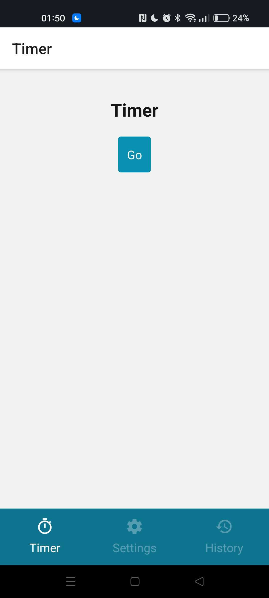
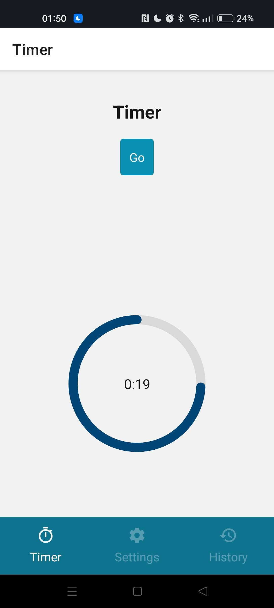
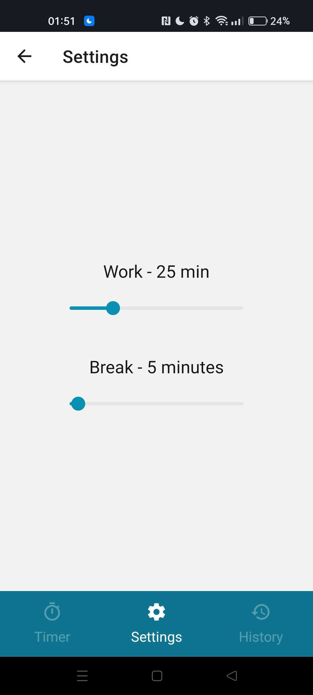

# Pomodor-O

| | | |
| ------- | ------- | ------- |
||||

## Install
To get started with the project, you will need to have Expo installed on your machine. If you don't have it already, you can install it by running the following commands:

Install expo :
```sh
npm install --global expo-cli
```
and get *Expo Go* application on your mobile

---------------------------------------

Install dependancies :
```sh
npm install
```

---------------------------------------

Finally, run expo start with defined script :
```sh
npm run start
```